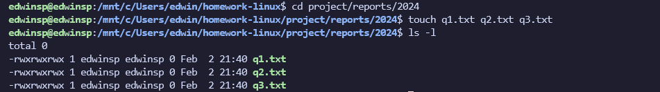
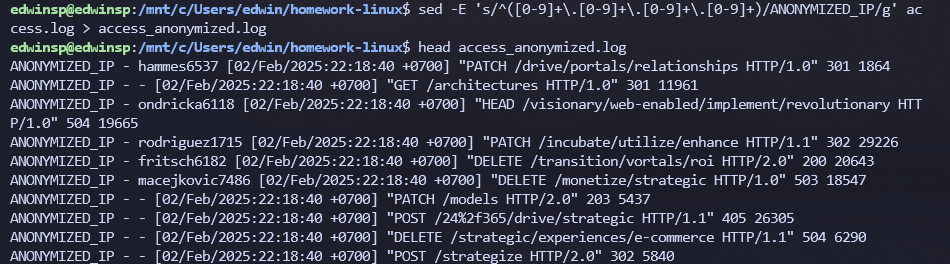

# DFG - Linux Hands-on Homework

> The assignment was done by Edwin

### Linux Learning Tasks

### Prerequisites

- Install Linux on a virtual machine (VM) or physical device.
- Install `flog` to generate fake logs.
- Install `stress` to simulate CPU and memory load.


### 1. File Management

- **Task 1.1:** Create a directory structure as follows:

    ```
    project/
    |-- reports/
    |   |-- 2024/
    |   |-- 2025/
    |-- scripts/
    |-- data/

    ```

  
  

- **Task 1.2:** Create three empty files in the `reports/2024` directory: `q1.txt`, `q2.txt`, and `q3.txt`.
  

- **Task 1.3:** Move `q1.txt` to the `2025` directory.
  

- **Task 1.4:** Copy `q2.txt` to the `scripts` directory and rename it as `analysis.txt`.
  

- **Task 1.5:** List all files in the `reports/2025` directory using `ls` and log the output to `file_list.log`.
  

- **Task 1.6:** Display the contents of `q3.txt` using `cat` and append "Task Completed" to the file.
  

- **Task 1.7:** Use `tree` to display the directory structure of the `project` directory and save the output to `structure.log`.
  

- **Task 1.8:** Remove the `scripts/analysis.txt` file and confirm its deletion by listing the contents of the `scripts` directory.
  

- **Task 1.9:** Copy the entire `project` directory to a new directory named `project-old`.
  

- **Task 1.10:** Delete the original `project` directory.
  

- **Task 1.11:** Create a large file (5GB) in the `data` directory using `dd` or `truncate`. Name it `large_file.dat`.
  

### 2. Output and Text Manipulation

- **Task 2.1:**Use `flog` to generate a fake log file named `access.log` with 2000 entries.

```bash
flog --entries 2000 > access.log
```

  

- **Task 2.2:** Extract and display all unique IP addresses from the `access.log` file using `awk` or `cut`.
  

- **Task 2.3:** Count how many times each IP address appears in the log file and save the results to `ip_counts.txt`.
  

- **Task 2.4:** Use `grep` to filter all log entries containing the status code `404` and save them to `errors.log`.
  

- **Task 2.5:** Replace all occurrences of the user agent string `"Mozilla"` with `"BrowserX"` in the `access.log` file and save the modified log as `access_modified.log`.
  

- **Task 2.6:** Extract all log entries from a specific date (e.g., "2025-01-01") using `grep` and save them into `specific_date.log`.
  

- **Task 2.7:** Use `awk` to calculate the total number of bytes transferred (from a specific column in the log) and output the result.
  

- **Task 2.8:** Combine `grep` and `awk` to find the IP address with the highest number of `404` errors and save the result in `top_404_ip.txt`.
  

- **Task 2.9:** Use `sed` to anonymize all IP addresses in the `access.log` file, replacing them with "ANONYMIZED_IP" and save it as `access_anonymized.log`.
  

- **Task 2.10:** Use pipes (`|`) to combine `grep` and `wc` commands to count the number of log entries with a `500` status code.
  


### 3. Process Management

- **Task 3.1:** Start a long-running process using the command `sleep 500 &` and note its PID.
  

- **Task 3.2:** Run `stress` in a separate terminal tab to simulate light CPU and memory usage: `stress --cpu 1 --vm 1 --vm-bytes 512M --timeout 30s`.
  

- **Task 3.3:** Use `top` or `htop` to monitor the system and identify resource usage by processes.
  

- **Task 3.4:** Use `ps` to verify the `sleep` process is running.
  

- **Task 3.5:** Use `df` and `du` to check disk space usage, particularly focusing on large files in the system.
  

- **Task 3.6:** Use `free` to monitor memory usage while `stress` is running.
  

- **Task 3.7:** Use `ps -aux` and `awk` to log processes consuming more than 10% CPU into a file `high_cpu.log` every 5 seconds.
  

- **Task 3.8:** Kill the long-running process started in Task 3.1 using its PID.
  


### 4. Networking Tools

- **Task 4.1:** Use `ping` to check the connectivity to `google.com` and log the output into `ping_output.txt`.
  

- **Task 4.2:** Use `ping` to check the connectivity to `google.com` with 10 packets, logging the output into `ping_10_packets.txt`.
  

- **Task 4.3:** Use `ping` to check the connectivity to `google.com` with a packet size of 1000 bytes, and log the output into `ping_large_packet.txt`.
  

- **Task 4.4:** Use `telnet` to test the connectivity to port 80 on `discord.com`.
  

- **Task 4.5:** Use `telnet` to check the connection to the SMTP server at `smtp.gmail.com` on port 25.
  

- **Task 4.6:** Use `curl` to fetch the content of `https://discord.com` and save it to a file `discord.html`.
  

- **Task 4.7:** Use `curl` to fetch the content of `https://google.com` and add a custom header `User-Agent: MyBrowser`.
  

- **Task 4.8:** Use `netstat` to list all active TCP connections on your system.
  

- **Task 4.9:** Use `netstat` to display all ports that are in the listening state on your system.
  

- **Task 4.10:** Use `iperf` in client mode to test the network bandwidth to a remote server (`iperf-server.google.com`).
  

- **Task 4.11:** Use `iperf` in server mode to listen for incoming connections on a remote machine (`iperf-server.discord.com`).
  

- **Task 4.12:** Use `nc` (Netcat) to check if port 443 is open on `discord.com`.
  

- **Task 4.13:** Use `nc` to send the message "Hello, Server!" to `google.com` on port 12345.
  

- **Task 4.14:** Use `nc` to start a simple HTTP server on port 8080 and serve a static HTML file.
  

- **Task 4.15:** Use `telnet` to connect to port 53 (DNS) on `8.8.8.8` and manually query for the domain `discord.com`.
  


### Submission Requirements

1. Document all tasks in this homework, including steps taken and command outputs, in a Notion or document file. Include relevant screenshots of terminal outputs.
2. Include a brief summary of challenges encountered and how they were resolved.
